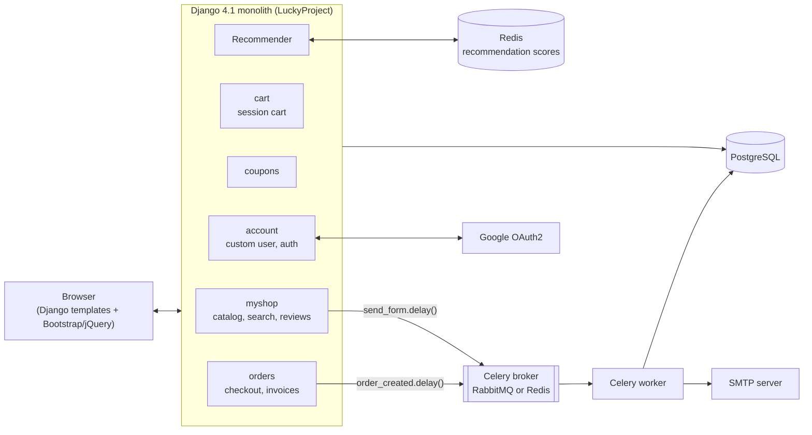

# Jouets Palace

A full-featured Django e-commerce storefront for a toy shop: nested catalog, session cart, coupons, checkout with emailed confirmations, and "frequently bought together" recommendations powered by Redis.


## Overview

Jouets Palace is a server-rendered, French-language online store built as a Django monolith. Shoppers browse a category tree, search products, fill a session-based cart, apply coupon codes and check out with bank transfer or cash on delivery. Order confirmations and contact messages are sent asynchronously through Celery, and every completed order feeds a Redis-backed recommender that suggests products commonly bought together. Staff manage the catalog and orders through a customised Django admin with CSV export and PDF invoices.

The site ran in production at jouetspalace.com and is no longer deployed.

<!-- TODO(Ayoub): Why you built it: the business context (real shop? client? learning project?), who used it, and what problem it solved. -->

<!-- TODO(Ayoub): Results/metrics, e.g. number of products, orders processed, traffic, uptime while it was live. -->

## Key features

- **Nested catalog**: unlimited-depth categories (django-mptt) with drag-and-drop ordering and per-category product counts in the admin; category pages include products from all sub-categories.
- **Products**: discounts, featured flag, image galleries, extra specs (weight, dimensions, colours, brand), paginated listings and an AJAX quick-view modal.
- **Search**: keyword search across name and description with an optional category filter and pagination.
- **Session cart**: add/update/remove items, AJAX shipping-option selection with live totals.
- **Coupons**: time-windowed percentage coupons, limited to one use per customer.
- **Checkout**: order form with two payment methods (bank transfer, cash on delivery); a Celery task sends an HTML confirmation email with a different template per payment method.
- **Recommendations**: "bought together" suggestions on product and cart pages, built from Redis sorted sets (`ZINCRBY` on each order, `ZUNIONSTORE` to merge scores across cart items).
- **Accounts**: custom `Customer` user model, registration/login, Google OAuth2 sign-in, password reset, and a dashboard with order history, profile editing and site reviews (TinyMCE rich text).
- **Staff tools**: order admin with inline items, CSV export action, order detail view and PDF invoices (xhtml2pdf).
- **Extras**: contact form (emailed via Celery), AJAX newsletter sign-up, returns-policy page, dynamic `robots.txt`.

## Architecture



The project is a single Django deployment split into focused apps (`myshop`, `cart`, `coupons`, `orders`, `account`, plus a `payment` stub). Pages are rendered on the server, and a few endpoints return JSON for AJAX interactions: shipping cost, newsletter sign-up and quick view. PostgreSQL stores the catalog, users and orders. Redis holds only the recommender's sorted sets, keyed `product:<id>:purchased_with`. Email is sent from Celery workers so checkout doesn't block on SMTP.

## Tech stack

| Area | Technologies |
|---|---|
| **Backend** | Python 3.10, Django 4.1, Celery 5.2, social-auth-app-django (Google OAuth2), django-mptt, django-filter, django-environ, xhtml2pdf |
| **Frontend** | Django templates, Bootstrap-based theme, jQuery, TinyMCE, django-widget-tweaks |
| **Data** | PostgreSQL (psycopg2), Redis (redis-py) |
| **Infra** | Celery broker (RabbitMQ by default, or Redis), SMTP email, WSGI/ASGI entry points |

## Getting started

These steps were verified on a fresh environment (Windows, Python 3.10, PostgreSQL 17).

### Prerequisites

- **Python 3.10**. Celery 5.2 doesn't work on Python 3.12.
- **PostgreSQL**
- **Redis** on `localhost:6379`. It's needed for product pages, the cart and checkout. Example: `docker run -d -p 6379:6379 redis:7`
- **A Celery broker**: RabbitMQ on `localhost:5672` (the default), or point Celery at Redis with `CELERY_BROKER_URL`.

### 1. Clone and create a virtual environment

```bash
git clone https://github.com/ayoub377/EcommerceDjango.git
cd EcommerceDjango
python3.10 -m venv venv
source venv/bin/activate          # Windows: venv\Scripts\activate
```

### 2. Install dependencies

```bash
pip install -r requirements.txt
```

### 3. Configure environment variables

```bash
cp .env.example .env
```

`settings.py` reads **every** variable in [`.env.example`](.env.example) without a default, so all of them must be present, even placeholder values for Google OAuth and Braintree. The important ones:

| Variable | Purpose |
|---|---|
| `SECRET_KEY`, `DEBUG` | Django core settings. Use `DEBUG=True` locally so static and media files are served. |
| `ENGINE`, `NAME`, `USER`, `PASSWORD`, `PORT` | Database connection. The host is fixed to `localhost`. |
| `EMAIL_*` | Outgoing mail. `django.core.mail.backends.console.EmailBackend` prints emails to the worker's terminal. |
| `SOCIAL_AUTH_GOOGLE_OAUTH2_*` | Google sign-in credentials |
| `BRAINTREE_*` | Sandbox credentials. Card payment is currently disabled, so placeholders are fine. |
| `CELERY_BROKER_URL` | Optional. Celery reads it from the environment, e.g. `redis://localhost:6379/0`. |

> **Linux/macOS note:** your shell already exports `USER`, and django-environ never overrides an existing variable. The database user will be your OS username unless you run with `USER=<db_user> python manage.py ...` or create a Postgres role with that name.

### 4. Create the database and run migrations

```bash
createdb jouets                   # or create it in pgAdmin / psql
python manage.py migrate
python manage.py createsuperuser
```

### 5. Run

Use three terminals, with Redis and the broker already running:

```bash
python manage.py runserver
```

```bash
celery -A LuckyProject worker -l info            # Windows: add --pool=solo
```

The shop is at http://127.0.0.1:8000/ and the admin at http://127.0.0.1:8000/admin/. `ALLOWED_HOSTS` only contains `127.0.0.1`, so use that address rather than `localhost`.

> Without a reachable broker, checkout returns a 500 error: `order_created.delay()` can't connect.

### Seed data

The repo has no fixtures. Log in to `/admin/` with your superuser and create:

1. A few **categories**, nested if you like, under *Myshop → Categories*. **Give each one an image**: the home page crashes if any category has none.
2. **Products** with an image, price and discount (use `0` for no discount), under *Myshop → Products*
3. Optionally a **coupon** under *Coupons*, with a validity window that includes today

Recommendations appear after a few orders have been placed with more than one product in the cart.

## Project structure

```
EcommerceDjango/
├── LuckyProject/   # Django project: settings, root URLs, Celery app, WSGI/ASGI
├── myshop/         # Catalog: categories (MPTT), products, images, reviews, search, recommender, newsletter
├── cart/           # Session-based cart, shipping cost, cart context processor
├── coupons/        # Coupon model, per-user usage tracking, apply view
├── orders/         # Checkout, order models, confirmation email task, admin CSV/PDF
├── payment/        # Braintree payment flow (currently stubbed out; not routed)
├── account/        # Custom Customer user, login/register, dashboard, Google OAuth
├── templates/      # All page, email and PDF templates
├── static/         # Theme CSS/JS, fonts, images, sitemap.xml
├── theme/          # django-tailwind app (installed; pages currently use the Bootstrap theme)
├── manage.py
└── requirements.txt
```

## Testing

There is no automated test suite yet: each app's `tests.py` is the empty Django default. The main flows were smoke-tested with Django's test client and a live Celery worker: browsing, search, cart and shipping totals, checkout, recommendations after an order, email tasks, and the admin order detail, PDF invoice and CSV export.

<!-- TODO(Ayoub): Add tests (cart totals and coupon logic, recommender, checkout view) and update this section. -->

## Status & next steps

The store was used in production and its core shopping flow works end to end. Known gaps and cleanup items:

**Partial or unfinished**
- **Online card payment (Braintree)**: the `payment` app's views and task are commented out and its URLs aren't included in the root URLconf. Only bank transfer and cash on delivery are active.
- **Product ratings**: `Product.average_rating()` / `get_top_rated_products()` refer to a `Rating` model that doesn't exist. Reviews are site-wide testimonials, not tied to a product.
- **Tailwind**: the `theme` app is installed, but the templates use the Bootstrap theme.

**Setup and repository hygiene**
- Dependencies are pinned to Django 4.1 and Celery 5.2, both past end of life. Upgrading would also unlock newer Python versions.
- A virtualenv (`ven/`) and compiled `__pycache__` files are committed.
- `ALLOWED_HOSTS`, the database host and the Celery broker aren't configurable through environment variables. `EMAIL_USE_TLS` and `EMAIL_PORT` aren't cast to bool and int.

**Next steps**
- Add a test suite and CI.
- Re-enable Braintree, or switch to another payment provider.
- Harden the views: CSRF on AJAX endpoints, validate the post-login `next` redirect, check review ownership on edit, and make checkout resilient to broker failures.
- Containerise: Docker Compose for Django, PostgreSQL, Redis and a Celery worker.

<!-- TODO(Ayoub): Lessons learned, e.g. running Celery and Redis in production, building the recommender, what you'd design differently today. -->

## Author

**Ayoub Ennaoui** · [LinkedIn](https://www.linkedin.com/in/ayoub-ennaoui)
